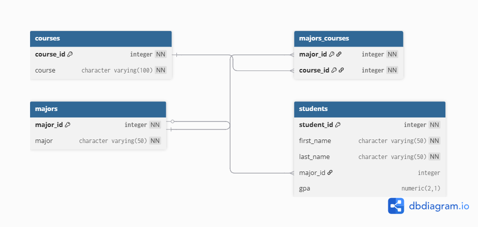

# Students Database Project

This project automates the creation and population of a relational database for student enrollment. It uses a **Bash script** to parse CSV data and inject it into a **PostgreSQL** database, ensuring data integrity by managing relational IDs for majors and courses, did this with Freecodecamp as a Course project.

## 🗄️ Database Schema

The database consists of four tables designed with normalized relationships:

* **`majors`**: Stores unique major names.
* **`courses`**: Stores unique course titles.
* **`majors_courses`**: A junction table linking majors to their required courses (Many-to-Many).
* **`students`**: Stores student names, GPAs, and their associated `major_id`.

---

## 📊 Entity Relationship Diagram



---

## 🚀 How to Use

### 1. Setup the Database

Use the provided SQL dump to create the database structure:

```bash
psql -U postgres < students.sql

```

### 2. Run the Import Script

The `insert_data.sh` script automates the entire import process. It handles data from `courses.csv` and `students.csv`, ensuring that no duplicate entries are created for majors or courses.

Make the script executable and run it:

```bash
chmod +x insert_data.sh
./insert_data.sh

```

---

## 📂 Project Structure

| File | Description |
| --- | --- |
| **`insert_data.sh`** | The main Bash automation script using `psql` and `while` loops. |
| **`students.sql`** | The database dump containing the schema and constraints. |
| **`courses.csv`** | Raw data containing Major and Course pairings. |
| **`students.csv`** | Raw data containing Student names, GPAs, and Majors. |
| **`drd.png`** | Database Relationship Diagram (ERD). |

---

## 💡 Technical Highlights

* **Loop Logic**: The Bash script uses `IFS=","` to parse CSV files and handles header rows using `if [[ $VARIABLE != "header_name" ]]`.
* **Data Integrity**: Before each run, the script performs a `TRUNCATE` with `RESTART IDENTITY` to ensure a clean state without bloating serial primary keys.
* **Conditionals**: Logic is included to check if a record exists (`-z $ID`) before attempting an insert, preventing primary key violations.
* **Subqueries**: The script dynamically fetches Foreign Keys (`major_id`, `course_id`) on the fly to populate junction and student tables correctly.

---

## 🛠️ Requirements

* PostgreSQL 12+
* Bash (Unix/Linux/macOS)
